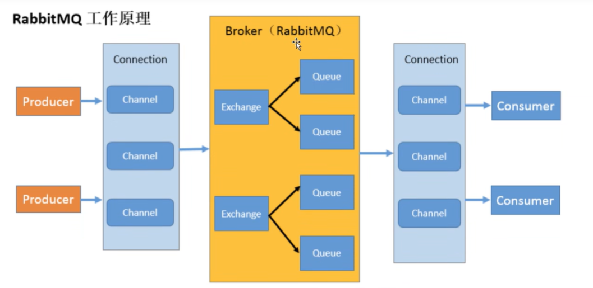
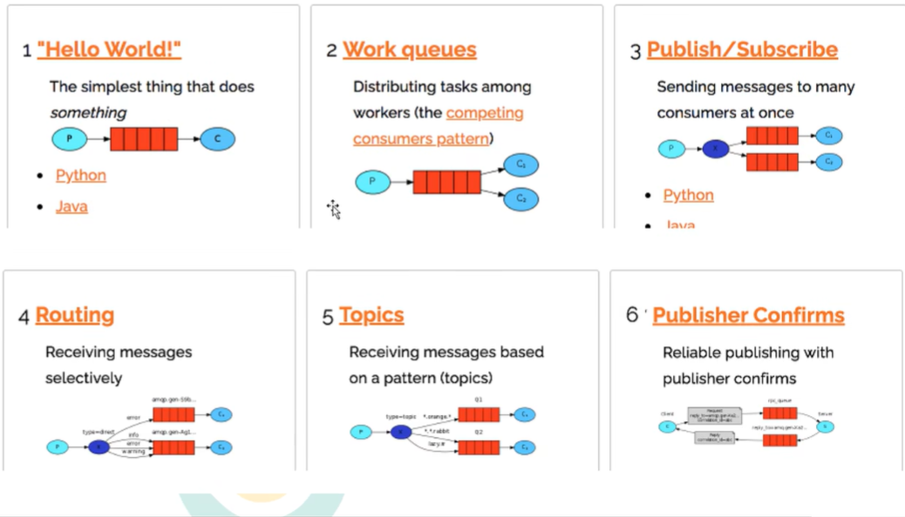

# 简介
```text
RabbitMQ 是一个消息中间件:它接受并转发消息。你可以把它当做一个快递站点，当你要发送一个包裹时，你把你的包裹放到快递站，
快递员最终会把你的快递送到收件人那里，按照这种逻辑 RabbitMQ 是一个快递站，一个快递员帮你传递快件。
RabbitMQ 与快递站的主要区别在于，它不处理快件而是接收。存储和转发消息数据。
```
# 四大核心概念 
```text
生产者
产生数据发送消息的程序是生产者

交换机
交换机是 RabbitMQ 非常重要的一个部件，一方面它接收来自生产者的消息，另一方面它将消息推送到队列中。
交换机必须确切知道如何处理它接收到的消息，是将这些消息推送到特定队列还是推送到多个队列，亦或者是把消息丢弃，这个得有交换机类型决定

队列
队列是 RabbitMQ 内部使用的一种数据结构，尽管消息流经 RabbitMQ和应用程序，但它们只能存储在队列中。
队列仅受主机的内存和磁盘限制的约束，本质上是一个大的消息缓冲区。许多生产者可以将消息发送到一个队列，许多消费者可以尝试从一个队列接收数据。这就是我们使用队列的方式

消费者
消费与接收具有相似的含义。消费者大多时候是一个等待接收消息的程序。请注意生产者，消费者和消息中间件很多时候并不在同一机器上。
同一个应用程序既可以是生产者又是可以是消费者。
```
# 基本结构
```text
Broker：接收和分发消息的应用，RabbitMQ Server 就是 Message Broker
Virtual host: 出于多租户和安全因素设计的，把 AMQP 的基本组件划分到一个虚拟的分组中，类似于网络中的namespace 概念。
              当多个不同的用户使用同一个 RabbitMQ server 提供的服务时，可以划分出多个vhost，每个用户在自己的 host 创建 exchange /queue 等
Connection: 连接。publisher / consumer和 broker 之间的TCP 连接
channel: 渠道。如果每一次访问 RabbitMQ 都建立一个 Connection，在消息量大的时候建立 TCP Connection 的开销将是巨大的，效率也较低。
         Channel 是在 connection 内部建立的逻辑连接，如果应用程席支持多线程，通常每个thread 创建单独的channel 进行通讯，
         AMQP method包含了 channel id 帮助客户端和 message broker 识别 channel，所以 channel 之间是完全隔离的。
         Channel 作为轻量级的Connection 极大减少了操作系统建立 TCP connection 的开销
Exchange：消息队列交换机，按一定的规则将消息路由转发到某个队列，对消息进行过虑。
Queue：消息队列，存储消息的队列，消息到达队列并转发给指定的消费者
Binding: exchange和 queue 之间的虚拟连接，binding 中可以包含 routing key，Binding 信息被保存到exchange 中的查询表中，用于 message 的分发依据
Producer：消息生产者，即生产方客户端，生产方客户端将消息发送
Consumer：消息消费者，即消费方客户端，接收MQ转发的消息。
```
# 工作原理

# 工作模式

# 消息流程 
生产者发送消息流程
```text
1、生产者和Broker建立TCP连接。
2、生产者和Broker建立通道。
3、生产者通过通道消息发送给Broker，由Exchange将消息进行转发。
4、Exchange将消息转发到指定的Queue（队列）
```
消费者接收消息流程
```text
1、消费者和Broker建立TCP连接
2、消费者和Broker建立通道
3、消费者监听指定的Queue（队列）
4、当有消息到达Queue时Broker默认将消息推送给消费者。
5、消费者接收到消息。
6、ack回复
```