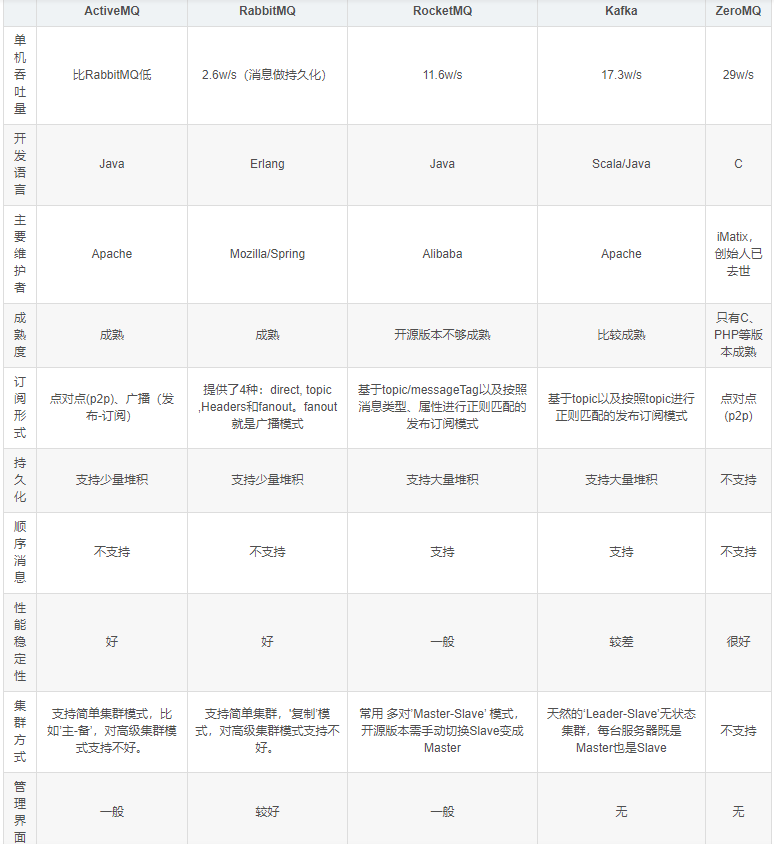

# MQ 概念
```text
MQ（Message Queue）消息队列，是基础数据结构中“先进先出”的一种数据结构。一般用来解决应用解耦，异步消息，流量削峰等问题，实现高性能，高可用，可伸缩和最终一致性架构。
```
# MQ 的优缺点
```text
优：
1、应用解耦。一个业务需要多个模块共同实现，只需要主业务完成以后，发送一条MQ，其余模块消费MQ消息，即可实现业务。主业务不依赖于其他模块，降低模块之间的耦合。
2、异步消息。主业务执行结束后，从业务通过MQ异步执行，减少业务的响应时间，提高用户体验。
3、流量削峰。高并发情况下，业务异步处理，提高业务处理能力，避免系统瘫痪。

缺：
1、系统可用性降低。依赖服务越多，服务越容易挂掉。需要考虑MQ瘫痪的情况
2、系统复杂性提高。需要考虑消息丢失、消息重复消费、消息传递的顺序性
3、业务一致性。主业务和从属业务一致性的处理
```
# MQ 选型

```text
1、ActiveMQ
优点：万级吞吐量、Java语言，毫秒级时效性，基于主从架构实现高可用
缺点：官方社区维护越来越少，高吞吐量场景较少使用。
应用场景：最早使用，现在已逐渐淘汰

2、RabbitMQ
优点：万级吞吐量、Erlang语言，微妙级时效性，基于主从架构实现高可用
缺点：商业版需要收费，学习成本较高
应用场景：结合 erlang 语言本身的并发优势，性能好时效性微秒级，社区活跃度也比较高，管理界面用起来十分方便，如果你的数据量没有那么大，中小型公司优先选择功能比较完备的 RabbitMO。

3、RocketMQ
优点：十万级吞吐量、Java语言、毫秒级时效性，支持分布式架构、顺序消息、大量堆积、支持事务消息
缺点：
应用场景：天生为金融互联网领域而生，对于可靠性要求很高的场景，尤其是电商里面的订单扣款，以及业务肖峰，在大量交易涌入时，后端可能无法及时处理的情况。
RocketMQ 在稳定性上可能更值得信赖，这些业务场景在阿里双 11 已经经历了多次考验，如果你的业务有上述并发场景，建议可以选择 RocketMQ

4、Kafka
优点：十万级吞吐量、Scale和Java语言、毫秒级时效性，支持分布式架构、顺序消息、大量堆积
缺点：
应用场景：Kafka 主要特点是基于 Pull 的模式来处理消息消费，追求高吞吐量，一开始的目的就是用于日志收集和传输，适合产生大量数据的互联网服务的数据收集业务。
大型公司建议可以选用，如果有日志采集功能肯定是首选 kafka 了。
```
# MQ 基础组成
```text
Broker：接收和分发消息的应用，RabbitMQ Server 就是 Message Broker
Virtual host: 出于多租户和安全因素设计的，把 AMQP 的基本组件划分到一个虚拟的分组中，类似于网络中的namespace 概念。
              当多个不同的用户使用同一个 RabbitMQ server 提供的服务时，可以划分出多个vhost，每个用户在自己的 host 创建 exchange /queue 等
Connection: 连接。publisher / consumer和 broker 之间的TCP 连接
channel: 渠道。如果每一次访问 RabbitMQ 都建立一个 Connection，在消息量大的时候建立 TCP Connection 的开销将是巨大的，效率也较低。
         Channel 是在 connection 内部建立的逻辑连接，如果应用程席支持多线程，通常每个thread 创建单独的channel 进行通讯，
         AMQP method包含了 channel id 帮助客户端和 message broker 识别 channel，所以 channel 之间是完全隔离的。
         Channel 作为轻量级的Connection 极大减少了操作系统建立 TCP connection 的开销
Exchange：消息队列交换机，按一定的规则将消息路由转发到某个队列，对消息进行过虑。
Queue：消息队列，存储消息的队列，消息到达队列并转发给指定的消费者
Binding: exchange和 queue 之间的虚拟连接，binding 中可以包含 routing key，Binding 信息被保存到exchange 中的查询表中，用于 message 的分发依据
Routing Key： 路由关键字，exchange根据这个关键字进行消息投递
Producer：消息生产者，即生产方客户端，生产方客户端将消息发送
Consumer：消息消费者，即消费方客户端，接收MQ转发的消息。
```
# RabbitMQ 工作原理


# RabbitMQ 工作模式

```text
1、simple模式(最简单的收发模式)
消息产生者将消息放入队列，消费者监听消息队列，如果队列中有消息，就消费掉，消息被拿走后，自动从队列中移除。
隐患：消息可能没有被消费者正确处理，就被移除了,造成消息的丢失
解决：可以设置成手动的ack,但如果设置成手动ack，处理完后要及时发送ack消息给队列，否则会造成内存溢出

2、work工作模式(资源的竞争)
消息产生者将消息放入队列，多个消费者同时监听同一队列，彼此相互竞争消息队列里的消息,谁先拿到谁负责消费消息

3、publish/subscribe发布订阅(共享资源)
每个消费者监听自己的队列；生产者将消息发给交换机，交换机将消息转发到绑定此交换机的每个队列，每个绑定交换机的队列都将接收到消息。

4、routing路由模式
消息生产者将消息并携带路由字符串key发送给交换机，交换机根据路由的key将消息转发给只能匹配上路由key的消息队列，对应监听的消费者才能消费消息;

5、topic主题模式(模糊匹配的路由模式)
消息产生者将消息发送给交换机，交换机根据key的规则模糊匹配到对应的队列,由队列的监听消费者接收消息消费
*：表示多个单词
#：表示一个单词

6、RPC模式 头部订阅
headers没有路由键，是根据消息头部header的键值对进行匹配，可以完全匹配也可以匹配任意一对键值对
```
# RabbitMQ 持久化
```text
默认情况下，exchange、queue、message 等数据都是存储在内存中的，这意味着如果 RabbitMQ 重启、关闭、宕机时所有的信息都将丢失。
RabbitMQ 提供了持久化来解决这个问题，持久化后，如果 RabbitMQ 发送 重启、关闭、宕机，下次启动时 RabbitMQ 会从硬盘中恢复exchange、queue、message 等数据。

RabbitMQ 持久化包含3个部分：
exchange 持久化，在声明时指定 durable 为 true
queue 持久化，在声明时指定 durable 为 true
message 持久化，在投递时指定 delivery_mode=2（1是非持久化）

如果将所有的消息都进行持久化操作，这样会严重影响 RabbitMQ 的性能。写入磁盘的速度可比写入内存的速度要慢很多。所以需要在可靠性和吞吐量之间做权衡。
将 exchange、queue 和 message 都进行持久化操作后，也不能保证消息一定不会丢失，消息存入RabbitMQ 之后，还需要一段时间才能存入硬盘。
RabbitMQ 并不会为每条消息都进行同步存盘，如果在这段时间，服务器宕机或者重启，消息还没来得及保存到磁盘当中，就会丢失。对于这种情况，可以引入 RabbitMQ 镜像队列机制。
```
# 消息重试机制
```text
spring:
  rabbitmq:
    listener:
      simple:
        retry:
          enabled: true
          max-attempts: 5 # 重试次数
          max-interval: 10000   # 重试最大间隔时间
          initial-interval: 2000  # 重试初始间隔时间
          multiplier: 2 # 间隔时间乘子，间隔时间*乘子=下一次的间隔时间，最大不能超过设置的最大间隔时间

重试失败策略：
RejectAndDontRequeueRecoverer：拒绝和不要重新排队(直接丢弃)
ImmediateRequeueMessageRecoverer：重新入队(原队列)
RepublishMessageRecoverer：重新发布(绑定新交换机、新队列)
```
# 死信队列
```text
一般来说，producer 将消息投递到 broker 或者直接到 queue 里了，consumer 从 queue 取出消息进行消费，
但某些时候由于特定的原因导致 queue 中的某些消息无法被消费，这样的消息如果没有后续的处理，就变成了死信，有死信自然就有了死信队列。

死信的来源
1、消息 TTL过期
2、队列达到最大长度(队列满了，无法再添加数据到 mq中)
3、消息被拒绝(basic.reject 或 basic,nack)并且requeue=false.
```

# 延时队列
```text
延时队列,队列内部是有序的，最重要的特性就体现在它的延时属性上，延时队列中的元素是希望在指定时间到了以后或之前取出和处理，
简单来说，延时队列就是用来存放需要在指定时间被处理的元素的队列。

延迟队列使用场景
1.订单在十分钟之内未支付则自动取消
2.新创建的店铺，如果在十天内都没有上传过商品，则自动发送消息提醒.
3.用户注册成功后，如果三天内没有登陆则进行短信提醒。
4.用户发起退款，如果三天内没有得到处理则通知相关运营人员。
5.预定会议后，需要在预定的时间点前十分钟通知各个与会人员参加会议
```
# 消息可靠性
```text
消息丢失的3种情况：
1、生产端丢失：
    网络异常或者交换机、队列挂了导致消息投递失败
2、MQ丢失：
    未开启RabbitMQ的持久化，数据存储于内存，服务挂掉后队列数据丢失；
    开启了RabbitMQ持久化，消息写入后会持久化到磁盘，但是在落盘的时候挂掉了，不过这种概率很小
3、消费端丢失
    消费者刚接收到消息还没处理完成，结果消费者挂掉了…
    


```
# 消息幂等性
```text

```
# 消息顺序性
```text

```
# 消息堆积
```text

```
