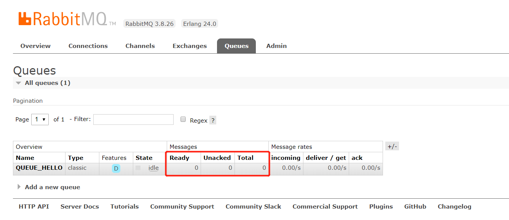

# 创建连接、信道

# 声明交换机
```text
String exchange, 交换机名称
BuiltinExchangeType type, 交换机类型 DIRECT("direct"), FANOUT("fanout"), TOPIC("topic"), HEADERS("headers");
boolean durable, 是否持久化。如果声明持久交换(该交换将在服务器重启后继续存在)，则为true。
boolean autoDelete, 是否自动删除。如果服务器在不再使用交换机时删除该交换机，则为true
boolean internal, 是否内部使用。如果交换是内部的，即不能直接由客户端发布，则为true。
Map<String, Object> arguments， 交换的其他属性(构造参数)
```
# 声明队列
```text
String name, 队列的名称
boolean durable, 是否持久化。false:队列在内存中,服务器挂掉后,队列就没了;true:服务器重启后,队列将会重新生成.注意:只是队列持久化,不代表队列中的消息持久化
boolean exclusive, 是否专属。专属的范围针对的是连接,也就是说,一个连接下面的多个信道是可见的.对于其他连接是不可见的.连接断开后,该队列会被删除.注意,不是信道断开,是连接断开.并且,就算设置成了持久化,也会删除.
boolean autoDelete, 是否自动删除。如果还没有消费者从该队列获取过消息或者监听该队列,那么该队列不会删除.只有在有消费者从该队列获取过消息后,该队列才有可能自动删除(当所有消费者都断开连接,不管消息是否获取完)
@Nullable Map<String, Object> arguments：可以为null的队列配置

x-message-ttl: 队列中的消息的生存周期,单位毫秒。
x-expires: 当队列在指定的时间内没有被使用(访问)就会被删除. 单位毫秒
x-max-length: 队列可以容纳的消息的最大条数,超过这个条数,队列头部的消息将会被丢弃.遵循队列的"先进先出(丢)"原则
x-max-length-bytes: 队列可以容纳的消息的最大字节数,超过这个字节数,队列头部的消息将会被丢弃.
x-overflow: 队列中的消息溢出时,如何处理这些消息.要么丢弃队列头部的消息,要么拒绝接收后面生产者发送过来的所有消息."drop-head" 默认行为，"reject-publish" 拒绝所有
x-dead-letter-exchange: 该参数值为一个(死信)交换机的名称,当队列中的消息的生存期到了,或者因长度限制被丢弃时,消息会被推送到(绑定到)这台交换机(的队列中),而不是直接丢掉
x-dead-letter-routing-key: 溢出的消息需要发送到绑定该死信交换机,并且路由键匹配的队列
x-max-priority: 设置该队列中的消息的优先级最大值.发布消息的时候,可以指定消息的优先级,优先级高的先被消费.如果没有设置该参数,那么该队列不支持消息优先级功能.也就是说,就算发布消息的时候传入了优先级的值,也不会起什么作用.
x-queue-mode: 设置队列为懒人模式.该模式下的队列会先将交换机推送过来的消息(尽可能多的)保存在磁盘上,以减少内存的占用.当消费者开始消费的时候才加载到内存中;如果没有设置懒人模式,队列则会直接利用内存缓存,以最快的速度传递消息.
x-queue-master-locator: 集群相关设置 略
```
# 发送消息
```text
channel.basicPublish();

exchange，交换机，如果不指定将使用mq的默认交换机（设置为""）
routingKey，路由key，交换机根据路由key来将消息转发到指定的队列，如果使用默认交换机，routingKey设置为队列的名称
props，向消费者传递的 消息属性(比如文本持久化MessageProperties.PERSISTENT_TEXT_PLAIN)
body，消息内容(二进制byte)
```
# Queue Messages 属性

```text
Ready：表示待消费数量；队列中拥有可以被消费者消费的消息数量。
Unacked：表示待确认数量；队列分配消息给消费者时，给该条消息一个待确认状态，当消费者确认消息之后，队列才会移除该条消息。
Total：表示待消费数和待确认数的总和
```
# 消费消息
```text
String queue 队列名称
boolean autoAck 自动回复，当消费者接收到消息后要告诉mq消息已接收，如果将此参数设置为tru表示会自动回复mq，如果设置为false要通过编程实现回复
Consumer consumer，消费方法，当消费者接收到消息要执行的方法

DeliverCallback deliverCallback：消息被接收时触发的回调
CancelCallback cancelCallback：消费者取消订阅队列时触发的回调
```
