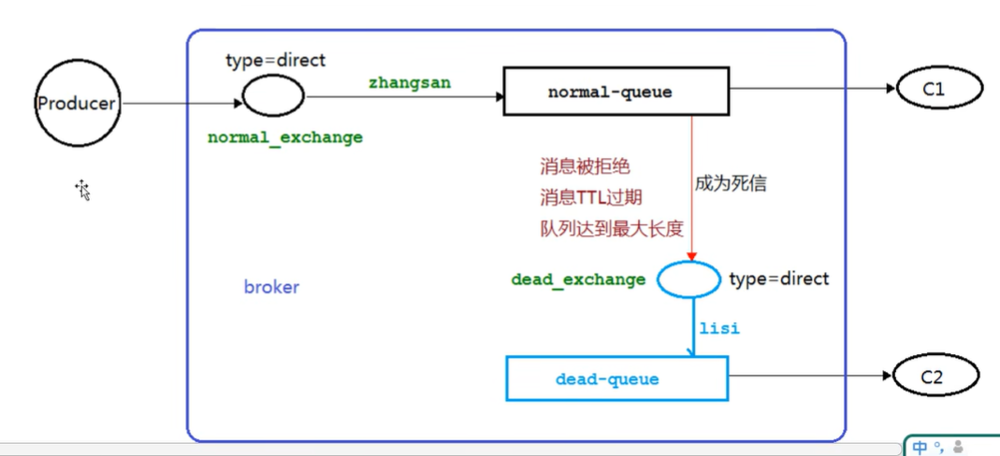

# 简介
```text
先从概念解释上搞清楚这个定义，死信，顾名思义就是无法被消费的消息，字面意思可以这样理解，一般来说，producer 将消息投递到 broker 或者直接到 queue 里了，
consumer 从 queue 取出消息进行消费，但某些时候由于特定的原因导致 queue 中的某些消息无法被消费，这样的消息如果没有后续的处理，就变成了死信，有死信自然就有了死信队列。

应用场景:为了保证订单业务的消息数据不丢失，需要使用到 RabbitMQ 的死信队列机制，当消息消费发生异常时，将消息投入死信队列中,
还有比如说: 用户在商城下单成功并点击去支付后在指定时间未支付时自动失效

死信队列：创建一个普通队列时，通过添加配置绑定另一个交换机(死信交换机)，在普通队列发生异常时，
消息就通过死信交换机转发到绑定它的队列里，这个绑定死信交换机的队列就是死信队列
```
# 死信的来源
```text
消息 TTL过期
队列达到最大长度(队列满了，无法再添加数据到 mq中)
消息被拒绝(basic.reject 或 basic,nack)并且requeue=false.
```
